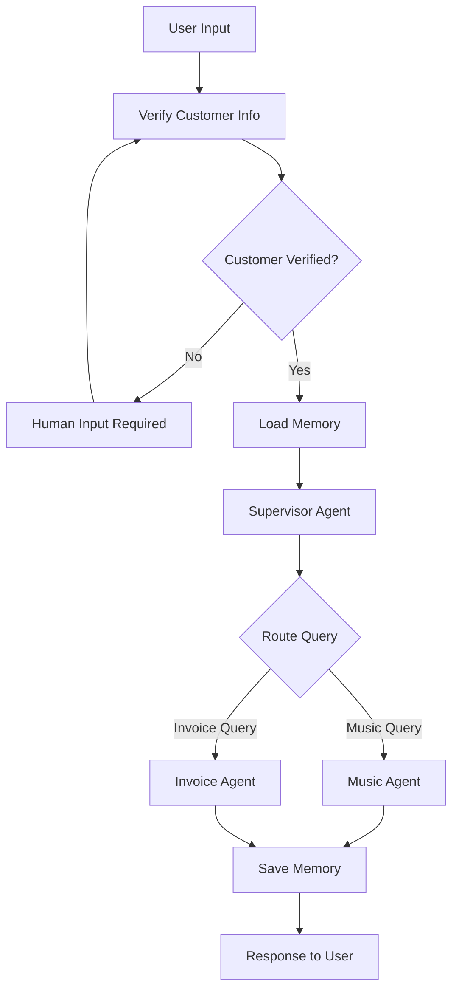

# 🤖 Multi-Agent LangGraph Template

[](https://www.python.org/downloads/)
[](https://github.com/langchain-ai/langgraph)
[](LICENSE)

A comprehensive, production-ready template for building sophisticated multi-agent AI systems using LangGraph. This template provides a modular architecture with customer verification, memory management, human-in-the-loop capabilities, and specialized domain agents.

## 🏗️ Architecture Overview

The Multi-Agent LangGraph Template implements a supervisor pattern where a central coordinator routes queries to specialized sub-agents. The system features:

- **🎯 Supervisor Agent**: Central orchestrator that routes queries to appropriate specialists
- **🔧 Specialized Agents**: Domain-specific agents (Music, Invoice) with dedicated tools
- **🧠 Memory Management**: Both short-term conversation context and long-term user preferences
- **👤 Human-in-the-Loop**: Customer verification and manual intervention points
- **🔗 Workflow Orchestration**: Complete conversation flows with state management



## 📁 Project Structure

```
├── 📁 src/                     # Core application source code
│   ├── 📁 agents/              # Agent implementations
│   ├── 📁 config/              # Configuration and settings
│   ├── 📁 memory/              # Memory management systems
│   ├── 📁 nodes/               # Workflow node implementations
│   ├── 📁 schemas/             # Data schemas and models
│   ├── 📁 tools/               # Agent tools and utilities
│   ├── 📁 utils/               # Utility functions
│   └── 📁 workflows/           # Workflow orchestration
├── 📁 tests/                   # Test suite
├── 📁 docs/                    # Documentation
├── 📁 notebooks/               # Jupyter notebooks for exploration
├── 📄 main.py                  # Main application entry point
├── 📄 requirements.txt         # Python dependencies
└── 📄 .env                     # Environment configuration
```

## 🧩 Core Components

### 🤖 Agents (`src/agents/`)

The agent system implements a supervisor pattern with specialized domain agents:

#### [`SupervisorAgent`](src/agents/supervisor_agent.py)

- **Purpose**: Central coordinator that analyzes queries and routes them to appropriate sub-agents
- **Architecture**: Uses LangGraph's supervisor pattern for intelligent routing
- **Integration**: Connects with memory manager for context-aware decisions
- **Key Features**:
  - Dynamic agent selection based on query content
  - Memory-aware routing decisions
  - State management across agent interactions

#### [`MusicAgent`](src/agents/music_agent.py)

- **Purpose**: Handles all music-related queries including recommendations, search, and catalog management
- **Tools**: Access to music database, recommendation algorithms, search functions
- **Use Cases**: Song recommendations, artist information, playlist management

#### [`InvoiceAgent`](src/agents/invoice_agent.py)

- **Purpose**: Manages billing, invoicing, and payment-related queries
- **Tools**: Database access for billing records, payment processing, invoice generation
- **Use Cases**: Payment history, invoice inquiries, billing support

### ⚙️ Configuration (`src/config/`)

#### [`Settings`](src/config/settings.py)

- **Purpose**: Centralized configuration management
- **Features**:
  - Environment variable integration
  - Model configuration (GPT-4, temperature settings)
  - Database connection settings
  - Memory store configuration options
- **Configurable Options**:

  ```python
  model_name: str = "gpt-4o-mini"
  temperature: float = 0.0
  embedding_model: str = "Alibaba-NLP/gte-modernbert-base"
  memory_store_type: str = "memory"  # "memory", "redis", "postgres"
  ```

#### [`Prompts`](src/config/prompts.py)

- **Purpose**: System prompts and instructions for different agents
- **Content**: Specialized prompts for supervisor routing, agent behaviors, and response formatting
- **Architecture**: Modular prompt system allowing easy customization per agent

### 🧠 Memory Management (`src/memory/`)

#### [`MemoryManager`](src/memory/memory_manager.py)

- **Purpose**: Unified interface for memory operations across the system
- **Features**: Supports multiple backends (in-memory, Redis, PostgreSQL)
- **Integration**: Provides checkpointers and stores for LangGraph workflows

#### [`LongTermMemory`](src/memory/long_term.py)

- **Purpose**: Persistent storage of user preferences, conversation history, and contextual data
- **Features**:
  - User preference tracking
  - Historical context retrieval
  - Customer profile management
- **Methods**:
  - `save_memory()`: Store conversation context and preferences
  - `load_memory()`: Retrieve user context for personalized responses

#### [`ShortTermMemory`](src/memory/short_term.py)

- **Purpose**: Manages immediate conversation context and temporary state
- **Scope**: Session-based memory that maintains context during active conversations
- **Integration**: Works with LangGraph's state management system

### 🔧 Tools (`src/tools/`)

#### [`MusicTools`](src/tools/music_tools.py)

- **Purpose**: Specialized tools for music-related operations
- **Functions**:
  - Music search and retrieval
  - Recommendation algorithms
  - Playlist management
  - Artist and album information lookup
- **Integration**: Database-backed with SQLAlchemy for efficient queries

#### [`InvoiceTools`](src/tools/invoice_tools.py)

- **Purpose**: Tools for financial and billing operations
- **Functions**:
  - Invoice generation and retrieval
  - Payment processing
  - Billing history analysis
  - Account balance inquiries
- **Security**: Implements proper authentication and data validation

### 📊 Schemas (`src/schemas/`)

#### [`State`](src/schemas/state.py)

- **Purpose**: Defines the shared data structure for workflow state management
- **Components**:

  ```python
  customer_id: str              # Verified customer identifier
  messages: List[AnyMessage]    # Conversation history with auto-aggregation
  loaded_memory: str           # User context from long-term memory
  remaining_steps: RemainingSteps  # Recursion prevention counter
  ```

- **Integration**: Used by LangGraph for state passing between workflow nodes

#### [`Models`](src/schemas/models.py)

- **Purpose**: Pydantic models for data validation and serialization
- **Features**: Type-safe data structures for API interactions and internal processing

### 🔄 Workflows (`src/workflows/`)

#### [`MultiAgentSupervisorWorkflow`](src/workflows/multi_agent_workflow.py)

- **Purpose**: Complete workflow orchestration implementing the supervisor pattern
- **Features**:
  - Customer verification flow
  - Memory loading and saving
  - Human-in-the-loop intervention points
  - Agent routing and execution
  - Error handling and fallback mechanisms
- **Workflow Steps**:
  1. **Verification**: Customer identity validation
  2. **Memory Loading**: Context retrieval from long-term storage
  3. **Supervision**: Query routing to appropriate agents
  4. **Execution**: Specialized agent processing
  5. **Memory Saving**: Context persistence for future interactions

### 🔗 Nodes (`src/nodes/`)

#### [`VerifyInfoNode`](src/nodes/verify_info_node.py)

- **Purpose**: Customer verification and identity validation
- **Features**:
  - Customer ID extraction from queries
  - Database verification against customer records
  - Security validation for sensitive operations
- **Integration**: Triggers human intervention when verification fails

#### [`HumanInputNode`](src/nodes/human_input_node.py)

- **Purpose**: Human-in-the-loop intervention point
- **Use Cases**:
  - Manual customer verification
  - Complex decision making
  - Quality control and oversight
- **Features**: Configurable intervention triggers and human interface integration

### 🛠️ Utilities (`src/utils/`)

#### [`Database`](src/utils/database.py)

- **Purpose**: Database setup, connection management, and ORM configuration
- **Features**:
  - SQLAlchemy integration
  - Customer and music catalog tables
  - Migration support and schema management
- **Tables**:
  - `customers`: Customer profiles and verification data
  - `music_catalog`: Song database with metadata
  - Additional tables for invoices and user preferences

#### [`Validation`](src/utils/validation.py)

- **Purpose**: Workflow validation and decision logic
- **Key Functions**:
  - `should_interrupt()`: Determines when human intervention is needed
  - Customer verification status checking
  - Data validation and sanitization

#### [`GraphUtils`](src/utils/graph_utils.py)

- **Purpose**: Utilities for LangGraph workflow management
- **Features**: Graph visualization, debugging helpers, and workflow optimization tools

## 🚀 Getting Started

### Prerequisites

- Python 3.9 or higher
- OpenAI API key
- Basic understanding of LangChain/LangGraph concepts

### Quick Setup

1. **Clone and Setup Environment**:

   ```bash
   git clone <repository-url>
   cd LangGraph
   python -m venv .venv
   source .venv/bin/activate  # On Windows: .venv\Scripts\activate
   ```

2. **Install Dependencies**:

   ```bash
   pip install -r requirements.txt
   ```

3. **Configure Environment**:

   ```bash
   cp .env.example .env
   # Edit .env with your API keys
   ```

4. **Run the Application**:

   ```bash
   python main.py
   ```

### Example Usage

```python
from src.workflows.multi_agent_workflow import MultiAgentSupervisorWorkflow
from src.config.settings import Settings
from langchain_core.messages import HumanMessage

# Initialize settings and workflow
settings = Settings()
workflow = MultiAgentSupervisorWorkflow(settings)
compiled_workflow = workflow.create_complete_workflow()

# Execute a query
message = HumanMessage(content="I need help with my music recommendations")
config = {"configurable": {"thread_id": "user_123", "user_id": "demo_user"}}
result = compiled_workflow.invoke({"messages": [message]}, config=config)
```

## 🔧 Customization

### Adding New Agents

1. **Create Agent Class**:

   ```python
   # src/agents/your_agent.py
   from .base_agent import BaseAgent
   
   class YourAgent(BaseAgent):
       def __init__(self, llm, tools=None):
           super().__init__(
               name="your_agent",
               description="Handles your domain",
               llm=llm,
               tools=tools or []
           )
   ```

2. **Register with Supervisor**:

   ```python
   # In workflow initialization
   your_agent = YourAgent(llm=llm, tools=your_tools)
   supervisor = SupervisorAgent(llm, [your_agent, music_agent, invoice_agent])
   ```

### Extending Tools

```python
# src/tools/your_tools.py
from langchain.tools import tool

@tool
def your_custom_tool(query: str) -> str:
    """Your tool description for the LLM."""
    # Implementation
    return result
```

### Memory Backends

The system supports multiple memory backends:

- **In-Memory**: Default, suitable for development
- **Redis**: For production caching and session management
- **PostgreSQL**: For persistent, scalable memory storage

Configure via `settings.memory_store_type`.

## 📚 Documentation

- **[Getting Started Guide](docs/getting_started.md)**: Detailed setup and usage instructions
- **[Architecture Deep Dive](docs/architecture.md)**: System design and component interactions
- **[API Reference](docs/api.md)**: Complete API documentation
- **[Deployment Guide](docs/deployment.md)**: Production deployment strategies
- **[Example Notebook](notebooks/langgraph.ipynb)**: Interactive exploration and examples

## 🧪 Testing

Run the test suite:

```bash
# Run all tests
python -m pytest tests/

# Run with coverage
python -m pytest tests/ --cov=src --cov-report=html
```

## 🤝 Contributing

1. Fork the repository
2. Create a feature branch: `git checkout -b feature/amazing-feature`
3. Commit changes: `git commit -m 'Add amazing feature'`
4. Push to branch: `git push origin feature/amazing-feature`
5. Open a Pull Request

## 📄 License

This project is licensed under the MIT License - see the [LICENSE](LICENSE) file for details.

## 🆘 Support

- **Issues**: Report bugs or request features via [GitHub Issues]
- **Discussions**: Join the community in [GitHub Discussions]
- **Documentation**: Check the `docs/` directory for comprehensive guides

## 🚀 Roadmap

- [ ] Multi-modal agent support (image, audio)
- [ ] Advanced memory backends (Vector databases)
- [ ] Agent marketplace and plugin system
- [ ] Real-time streaming responses
- [ ] Advanced monitoring and analytics
- [ ] Kubernetes deployment templates

---

**Built with ❤️ using LangGraph and LangChain**
